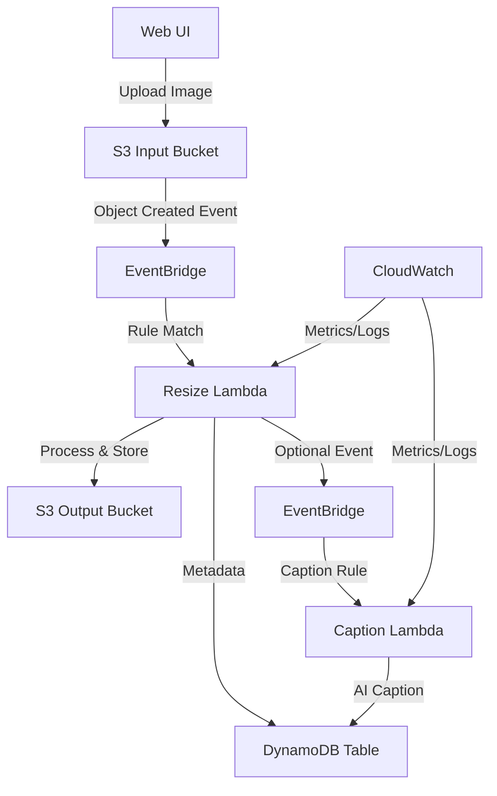

# Event-Driven Image Processing Workshop

## Description

This workshop introduces Event-Driven Architecture (EDA) using AWS services. Participants will build a serverless image processing pipeline that automatically resizes uploaded images and optionally generates captions using generative AI. The focus is on configuring event flows, monitoring, and understanding EDA principles without deep coding.

Key learning outcomes:
- Configure AWS EventBridge for event routing
- Implement serverless processing with Lambda
- Monitor event-driven systems with CloudWatch
- Explore optional AI integration with Amazon Bedrock

## Architecture

## Prerequisites

- AWS account with free tier access
- Basic familiarity with AWS console (IAM, S3, Lambda)
- Internet connection for web UI access
- Optional: Bedrock model access for GenAI extension

## Target Audience

- 200-level workshop: Assumes basic AWS knowledge, introduces EDA concepts
- Developers, architects, or IT professionals new to event-driven patterns
- No prior EDA experience required, but AWS fundamentals helpful

## Getting Started

1. Clone this repository
2. Run `./build.sh` to package and upload resources
3. Deploy CloudFormation stack: `src/templates/cloudformation.yaml`
4. Follow the workshop guide in `workshop-guide.md`

## Resources

- [Workshop Plan](workshop-plan.md)
- [Workshop Guide](workshop-guide.md)
- [Test Plan](specs/workshop/test-plan.md)